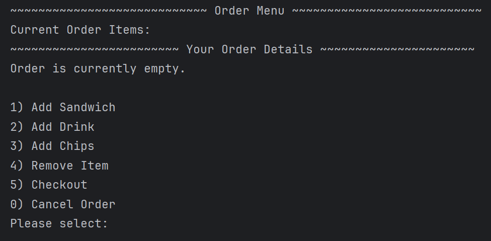
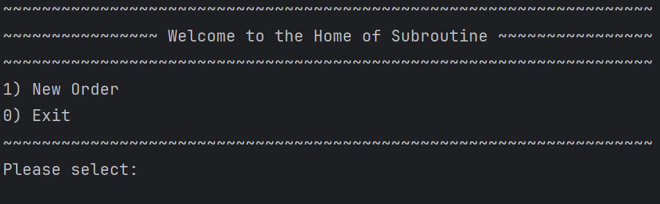
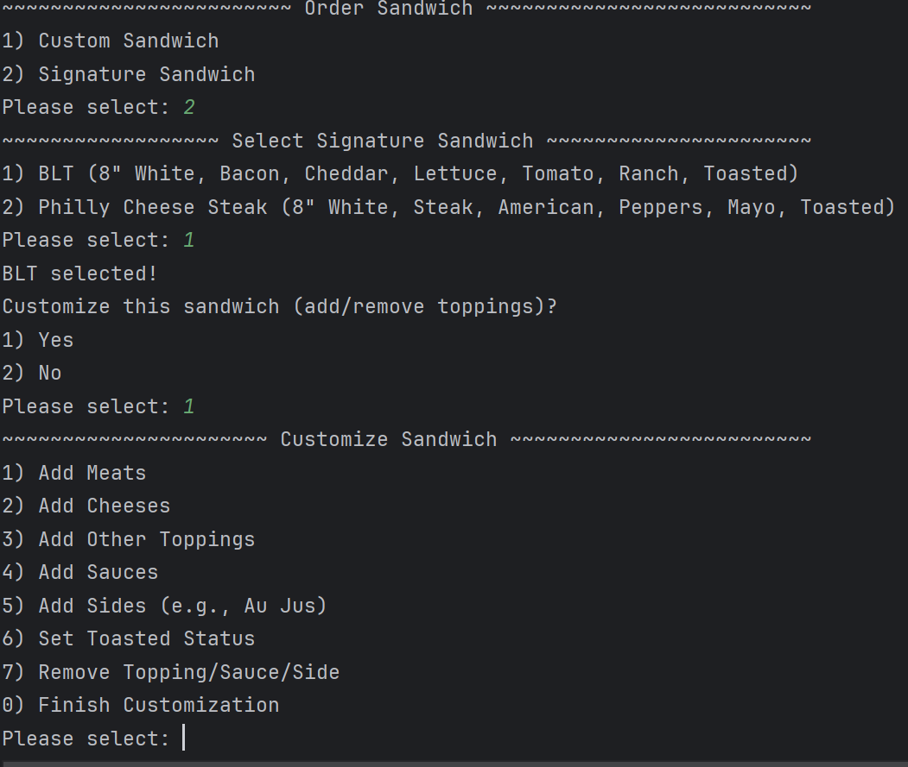
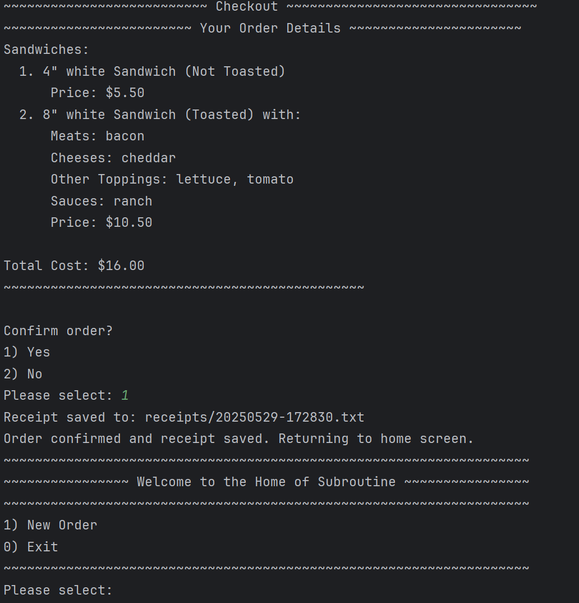
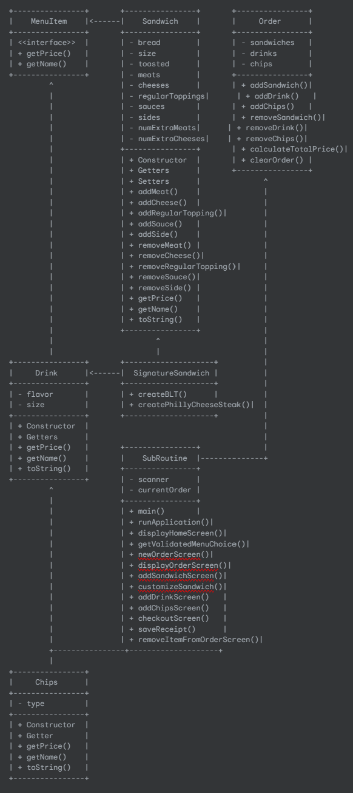

# SubRoutine
Capstone 2: DELI-cious - Java CLI Application

<strong>SubRoutine: Your new routine.</strong>

 <pre> About SubRoutine </pre> 
This project implements a command-line interface (CLI) point-of-sale (POS) application for "DELI-cious," a custom sandwich shop. 
The application automates the order process, allowing customers to customize sandwiches, add drinks and chips, and generate receipts. 
It is designed with Object-Oriented Programming (OOP) principles, utilizing classes and interfaces to manage different menu items and the overall order flow.

 <pre> Features  </pre> 

Home Screen: Provides options to start a new order or exit the application.

Order Screen: Allows customers to add sandwiches, drinks, or chips to their current order. Displays a summary of items currently in the order.

Add Sandwich:

Custom Sandwiches: Users can select bread type, sandwich size, and then add various meats, cheeses, regular toppings, and sauces.

Signature Sandwiches: Users can choose from predefined signature sandwiches (e.g., BLT, Philly Cheese Steak).

Customization: After selecting a sandwich (custom or signature), users can add or remove additional toppings, sauces, or sides.

Toasting Option: Customers can choose to have their sandwich toasted.

Extra Meat/Cheese: Explicit options to add "extra" portions of meat and cheese, which incur additional costs based on sandwich size.

Add Drink: Customers can select a drink flavor and size.

Add Chips: Customers can select a chip type.

Remove Item from Order: Allows users to remove specific sandwiches, drinks, or chips from the current order by selecting their type and then the item's number.

Checkout: Displays the complete order details and the total cost. Prompts for confirmation before finalizing the order.

Receipt Generation: Upon order confirmation, a detailed receipt file is generated and saved in a receipts folder.

Robust Input Handling: All menu selections are number-based,  ensuring a smoother user experience.

 <pre> Screenshots  </pre>

Home Screen: 

Order Menu:

Order Signature Sandwich:

Receipt : 

 <pre> Class Diagram  </pre>

Class Diagram: 

 <pre> Interesting Code Snippet  </pre>

// Example of a removal helper method

private static void removeToppingFromSandwich(Sandwich sandwich) {

// ... (displays current toppings and prompts user for selection) ...

int categoryChoice = getValidatedMenuChoice(0, 6,

"Select category to remove from:\n" +

"1) Meats\n" +

// ... (other categories) ...

"0) Back to Sandwich Customization\n" +

"Enter choice: ");

// ... (logic to handle removal based on categoryChoice and user input) ...

}

 <pre> Getting Started  </pre>
Prerequisites:

Java 17+ installed

IDE (IntelliJ IDEA, VS Code, Eclipse) or just a terminal

Installation & Run

Clone the repository:
git clone https://github.com/berkcanemre/PennyPilot.git

Open the project in your IDE.

Run LedgerApp.java to start the application!

 <pre>  Technologies Used </pre>

Java 17

File I/O (BufferedReader/BufferedWriter)

Object-Oriented Programming (OOP)

Command-Line Interface (CLI)

 <pre> Author </pre>

Berkcan Emre

https://github.com/berkcanemre

 <pre> License </pre>

This project is open source and available under the MIT License.

 <pre> Acknowledgements </pre>

Special thanks to Yearup United’s staff and instructors, especially Cristopher Carter who inspired the project idea.
e

 <pre> Take a bite of your new SubRoutine </pre>
